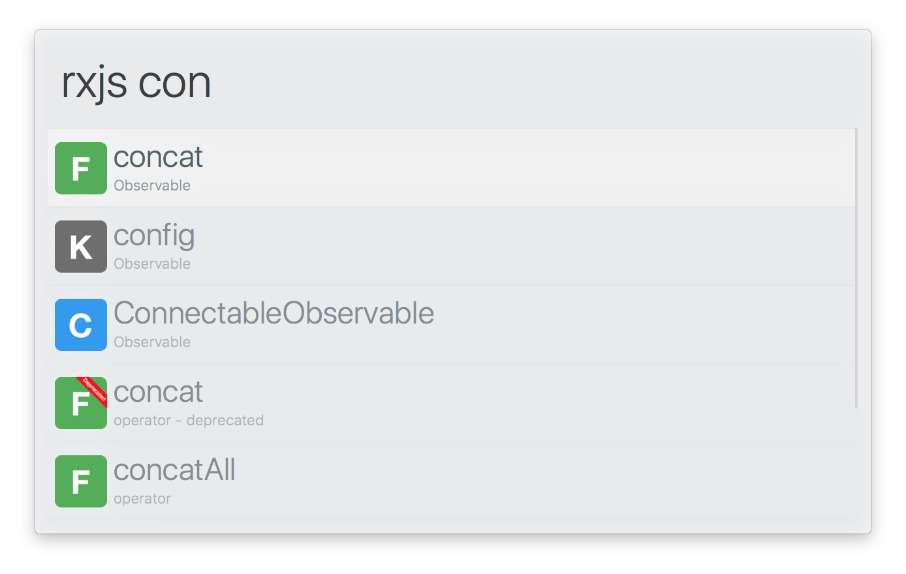

# arvis-rxjs-workflow




## Install

```
$ npm install -g arvis-rxjs-workflow
```

## Usage

In arvis, type `rxjs`, <kbd>Enter</kbd>, and your query.

Select an item and press <kbd>Enter</kbd> to go to its [RxJS](http://reactivex.io/rxjs) documentation.<br>
Press <kbd>Shift</kbd> to view the documentation in Quick Look.


## License

MIT © [Sam Verschueren](https://github.com/SamVerschueren)

## 🔗 This workflow is converted from [alfred-workflow](https://github.com/SamVerschueren/alfred-rxjs).

* Note that there might be some code change or different actions from the original workflow.

* Marked original workflow's creator to author.
